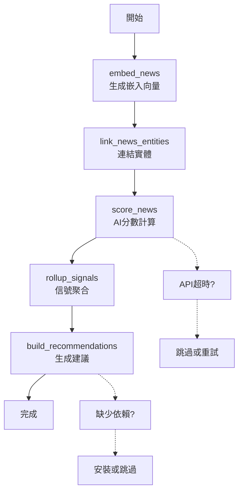

# 完整新聞分析流水線使用指南

我已經為您創建了一個完整的新聞分析流水線命令，可以一次執行所有步驟。

## 🚀 流水線步驟

完整流水線包含以下 6 個步驟：

1. **📰 ingest_rss** - 從 RSS 源攝取新聞文章（可選）
2. **📊 embed_news** - 為新聞生成嵌入向量
3. **🔗 link_news_entities** - 連結新聞與實體（公司/行業）
4. **🤖 score_news** - 使用 AI 模型計算新聞分數
5. **📈 rollup_signals** - 聚合信號到公司和行業
6. **💡 build_recommendations** - 生成投資建議

## 📋 可用命令

### Makefile 命令（推薦）

```bash
# 完整流水線（詳細輸出）
make full-pipeline

# 快速版本（較短時間範圍）
make full-pipeline-fast  

# 跳過建議生成（當缺少 pandas 時）
make full-pipeline-skip-reco

# 舊的命令別名
make recommendations
```

### 直接 Django 命令

```bash
cd mytrading

# 完整流水線（所有步驟）
python manage.py process_news_pipeline --verbose

# 自定義參數
python manage.py process_news_pipeline \
  --since-hours 24 \
  --lookback-hours 168 \
  --model deepseek-reasoner \
  --half-life 72 \
  --apply-overall-when-missing \
  --verbose

# 跳過建議生成
python manage.py process_news_pipeline \
  --since-hours 24 \
  --skip-recommendations \
  --verbose
```

## ⚙️ 參數說明

### 新聞攝取參數
- `--max-news`: 每個RSS源最多攝取新聞數量（默認 40）
- `--feed`: 指定RSS源URL，可多次使用（默認使用內建源）
- `--allow-langs`: 允許的語言（默認 en,zh）
- `--skip-ingest`: 跳過新聞攝取步驟

### 新聞處理參數
- `--since-hours`: 處理最近 N 小時的新聞（默認 24）
- `--model`: AI 模型名稱（默認 deepseek-reasoner）
- `--half-life`: 新聞分數時間衰減半衰期，小時（默認 72）
- `--lookback-hours`: 信號聚合回看時間，小時（默認 168）
- `--apply-overall-when-missing`: 當無精準匹配時使用整體情感

### 建議生成參數
- `--benchmark`: 基準指數（默認 SPY）
- `--min-cap`: 最小市值過濾（默認 20B）
- `--universe-limit`: 股票池最大數量（默認 800）
- `--rs-threshold`: 相對強度閾值（默認 70.0）
- `--alpha`: 新聞權重係數（默認 0.2）
- `--k`: tanh 壓縮係數（默認 1.0）
- `--save-top`: 保存前 N 個建議（默認 200）

### 控制選項
- `--skip-recommendations`: 跳過建議生成步驟
- `--verbose`: 顯示詳細輸出

## 🔧 故障排除

### 1. DeepSeek API 超時錯誤

**錯誤信息:**
```
[score_news:skip] id=11 err=HTTPSConnectionPool(host='api.deepseek.com', port=443): Read timed out.
```

**解決方案:**

a) **跳過新聞分數計算**（推薦用於測試）:
```bash
# 只執行前兩步和後兩步，跳過 AI 分數計算
python manage.py embed_news --days-back 1
python manage.py link_news_entities --days-back 1  
python manage.py rollup_signals --lookback-hours 24
```

b) **使用不同的 AI 模型**:
```bash
python manage.py process_news_pipeline --model gpt-3.5-turbo --verbose
```

c) **增加超時時間** - 需要修改 `news_scoring.py` 中的超時設定

d) **批量處理** - 減少 `--since-hours` 參數，分批處理新聞

### 2. 缺少 pandas/yfinance 錯誤

**錯誤信息:**
```
ModuleNotFoundError: No module named 'pandas'
```

**解決方案:**

a) **安裝依賴**:
```bash
pip install pandas yfinance
```

b) **跳過建議生成**:
```bash
make full-pipeline-skip-reco
```

### 3. 沒有新聞數據

**錯誤信息:**
```
No chunks to embed.
Linked entities written: 0
```

**解決方案:**

先攝取一些新聞數據：
```bash
make news-ingest  # 攝取新聞
make news-embed   # 生成嵌入
```

## 📊 執行結果查看

### 1. 檢查信號數據

```bash
# 查看新聞分數信號
curl http://localhost:8001/api/signals/news-score-summary/ | jq .

# 查看特定公司信號
curl http://localhost:8001/api/companies/AAPL/news-score-signal/ | jq .
```

### 2. 數據庫查詢

```bash
make psql

# 檢查新聞分數
SELECT COUNT(*) FROM news_newsitem WHERE news_scores_json IS NOT NULL;

# 檢查信號聚合結果
SELECT COUNT(*) FROM research_analyticscompanysignal WHERE window_count > 0;

# 檢查投資建議
SELECT COUNT(*) FROM analytics_analyticsrecommendation;
```

## 🎯 使用建議

### 1. 首次運行

```bash
# 確保有基礎數據
make init-all

# 攝取一些新聞
make news-ingest

# 運行完整流水線（跳過建議生成）
make full-pipeline-skip-reco
```

### 2. 日常運行

```bash
# 每日更新（包含建議生成）
make full-pipeline

# 或者設置 cron 任務
0 6 * * * cd /path/to/project && make full-pipeline
```

### 3. 快速測試

```bash
# 只處理最近 1 小時的新聞，跳過建議
python manage.py process_news_pipeline \
  --since-hours 1 \
  --lookback-hours 24 \
  --skip-recommendations \
  --verbose
```

## 🔄 流水線流程圖



## 📈 監控和維護

### 1. 性能監控

```bash
# 查看執行時間
time make full-pipeline

# 監控 API 使用情況
curl http://localhost:8001/api/metrics/summary/
```

### 2. 錯誤處理

流水線具有內建錯誤處理：
- 每步驟獨立執行，失敗時停止
- 提供詳細錯誤信息和建議
- 支援跳過有問題的步驟

### 3. 自動化部署

```bash
# 添加到 crontab
crontab -e

# 每天早上 6 點執行
0 6 * * * cd /Users/tobychunyu/Downloads/trading-infra-mvp/backend && make full-pipeline >> /var/log/trading-pipeline.log 2>&1
```

這個完整的流水線命令讓您可以一次執行所有新聞分析步驟，從原始新聞到最終的投資建議！
